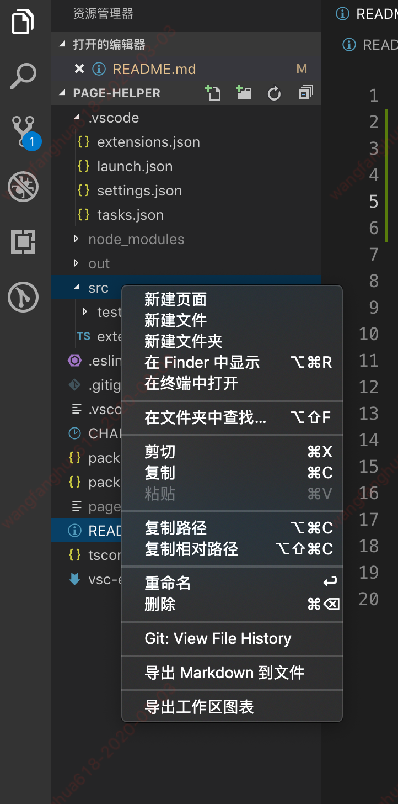
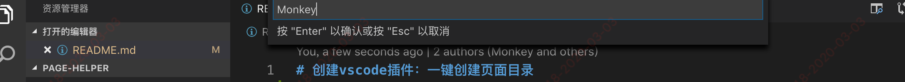
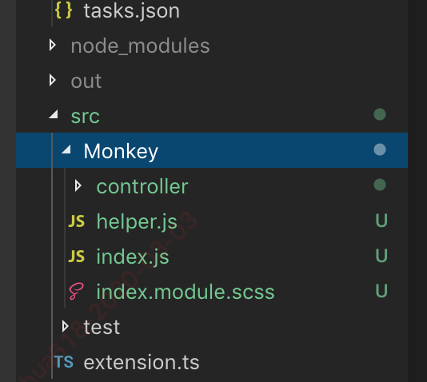

# 创建vscode插件：一键创建页面目录
## 使用方法
* 对应文件夹点击右键，弹出菜单，点击 "新建页面" 菜单
* 输入模块名加后缀，例如：monkey.js可以创建js页面目录，默认是ts文件目录



* 输入页面名称



* 创建目录



## 使用的技术栈即默认导入的依赖
* react
* react-dom
## 页面目录
```
    pageName
        index.jsx
        index.module.scss
        heler.js
        controller
            type.js
            actions.js
            reducers.js
```